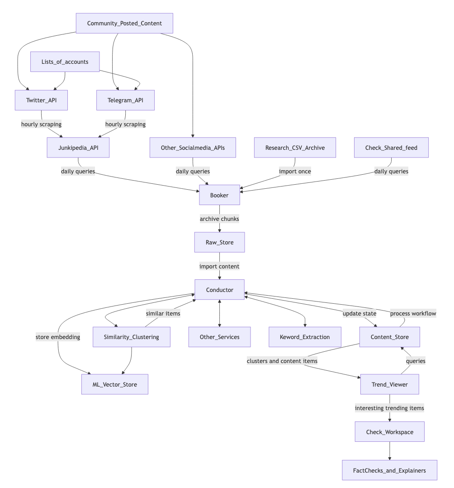
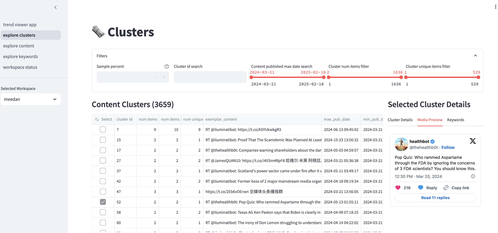
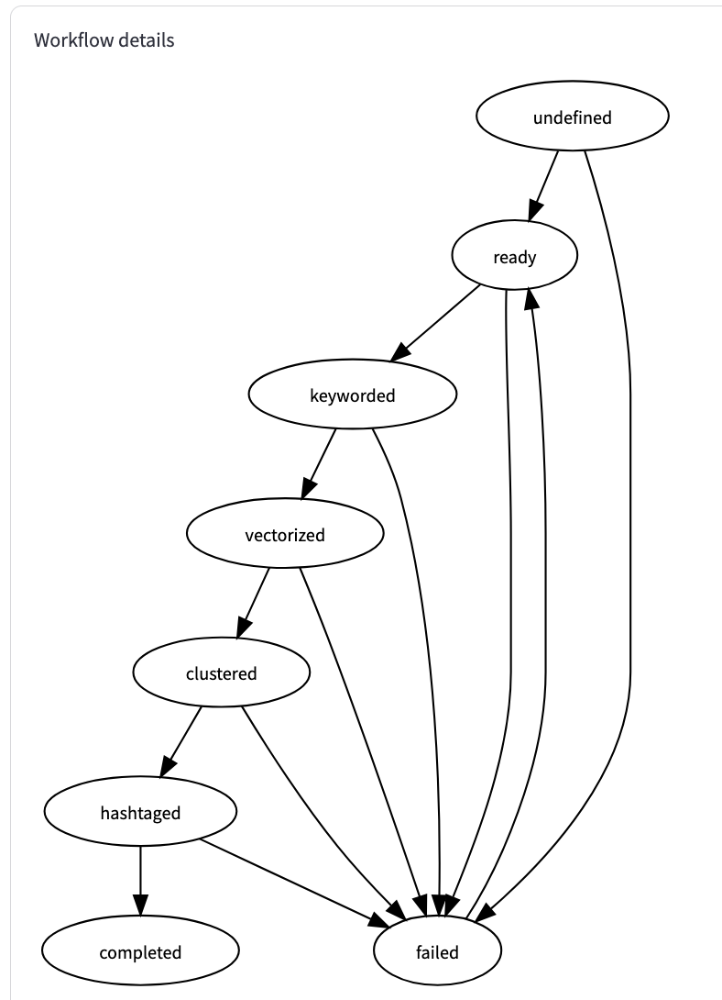

# Timpani Public
This is the open source repository for Meedan's Timpani flexible ML infrastructure for managing data collection, transformation, modeling and inference.  

__NOTE: This project is not under active development.__

Timpani has tools for downloading content items from API or other datasource, processing through various models (clustering, keyword extraction, etc), and a viewer for exploring trends in content. 

## Theory of operation 



Timpani employs the concept of team-specific 'workflow' that describe the process of acquiring and archiving 'content items', and a 'state model' that determines the sequence of steps each item must flow through. Using the state model, it orchestrates the process of iteratively
routing data items to approprite model services (and responding to callbacks), resuming after failures or outages.   It also supports a representation of clusters, (and cluster history for trends) and various annotations of data items. 

Currently Timpani is limited to working with text content, but is designed to work with content in many languages. 

Timpani can be run locally at small scale or its containers can be deployed in a cloud environment for large workflows and resource-heavy models. It is a 'medium-data' tool, aiming for flexibility, transparency and ease of connecting to other services over bulk data processing speed. 


## Design components (more detail)

Timpani is constructed of muliple services:

* An acquisition service ("Booker") which runs independently and can be scheduled to acquire  data from external services into a raw store and keep track of download state. 
* The "Raw Store" that archives the content downloaded from booker
* "Conductor" runs regularly (or triggered by booker) to import raw data from content store, and use team-specific workflows to extract the relevent content into the "Content Store".  The conductor also usess workflows to manage routing the content to external services for processing, and recieves callbacks to update the items. It also manages varous housekeeping tasks like removing old content and checking if clusters need to be updated. 
* The content store holds the current state of content items, annotations, keywords, clusters, and the overall processing state for each item. It is structured as a relational database and can be directly queried (read-only) by other services
* Trend Viewer provides a simple user interface for browsing and searching each team's processed content in the content store to look for trends or to locate interesting and concerning content that needs further action.



State is maintained in the content_store (databases are very good at transations and state) which means in theory the other process can be run in parallel. 

Timpani uses several other open-source Meedan services:

* Alegre https://github.com/meedan/alegre (text similarity computation and clustering)
* Presto https://github.com/meedan/presto (LLM model hosting)

## Workspaces

Workspaces are defined by a config file, are permissoned to a speciic team, and determine a "space" in which content is assumed to be relevant to the same topic(s) and processed in ways that make items mutually comparable. A workspace can contain data from multiple data sources and can contain content processed from different workflows if necessary. 

## Workflows

Workflows define how content items should be extracted from raw content acquired from 3rd party sources.  Multiple content items can be extracted from a single piece of raw content, i.e. "title", "description" and "transcript" of a YouTube video might all be relevant.



Workflows also define the state model that determines the sequence of transformations, model annotations, actions that the content will pass through.  Both by literally defining the set of allowable states, and exactly which function should be called next. 

See sequence diagrams in /docs


## How to run services

All the of the functionality of services can be run by calling scripts with appropriate CLI arguments

In production, 
- the 'booker' (content acquisition and archiving) tool is deployed as a container which starts periodically to run updates when triggered by a scheduled task. 
- the 'raw_store' is an S3 bucket
- the 'conductor' (content processing orchestrator) app runs in a container deployed as an AWS ECS service and accepts commands and callbacks via its API
- the 'content_store' is run as an AWS RDS Postgres cluster.  
   -  Database migrations are managed by Alembic, and applied using
    - `docker compose run conductor content_store setup` will initialize the database and setup appropriate users (run automatically if needed on container initialization)
    - `docker compose run conductor content_store migrate` will apply the most recent migration
    - `docker compose run conductor content_store destroy` will DELETE ALL DATA and tear down the database objects and users and delete the database (for testing reinitialization)
- the 'trend_viewer' runs as in a container deploayed as an AWS ECS Services


### Running locally

The necessary containers (and most of the services) can be spun up as local Docker containers, including a postgres database for the content and state store and Minio as an alternative to AWS S3 for raw archiving storage. 

#### Using 'booker' to acquire content

```
docker compose run --env S3_STORE_LOCATION=s3.amazonaws.com --env DEPLOY_ENV=qa booker acquire --workspace_id=meedan
```

These environment variables tell it to acquire all the queries for the meedan workspace for 'yesterday' and write to the S3 store location in the `qa` environment.  Adding a `--date_id=YYYYMMDD` flag will load for a specific day 

A more normal testing command to run everything in local dev environment would be:

```
docker compose run booker acquire --workspace_id=test --date_id=20230906  
```

Booker can trigger conductor to ingest and process the raw content in a completed download partition
```
docker compose run booker acquire --workspace_id=test --trigger_ingest=True
```


#### Using 'conductor' to process content

This will attempt to process content from s3 storange partition described by the arguments (usually the output of a booker acquisition)

```
docker compose run conductor process raw --workspace_id=test --date_id=YYYYMMDD --source_id=faker_testing
docker compose run conductor process raw --workspace_id=test --date_id=20230905 --source_id=junkipedia 
```

To indirectly trigger the workflow processing for the newly ingested data
```
docker compose run conductor process raw --workspace_id=test --trigger_workflow=True
```

To directly trigger the processing loop to move data through its statemodel workflow:
```
docker compose run conductor process workflows  --workspace_id=test 
```


In in production, these steps are normally triggered via the conductor's API, which can be called from inside the VPN

```
curl <path to the conductor service>/start_workflow/test
curl <path to the conductor service>/stop_workflow/test
```

```
curl <path to the conductor service>/start_workflow/running_processes
```

```
curl <path to the conductor service>/start_workflow/status_summary
```

#### User 'trend_viewer' to explore content

The Trend Viewer service launches a web app with tabular and trend charts for exploring the clusters and content that are the result of the data processing pipelines. The trend viewer has a read-only connection to the data in the content store

```
docker compose up trend_viewer
```

#### Configure local aws authorization

In order to allow the app to access secrets in SSM, it needs to be able to assume
a specifc AWS IAM role (arn:aws:iam::848416313321:role/timpani-task-execution-role). NOTE: Think this is no longer needed?

This is acomplished by authorizing a profile sesssion in the hosting laptop with `aws sso login`
and then sharing the authorization tokens and profile with the docker container via
a mounted directory.

In the laptop, the `~/.aws/config` needs to include permissions for the host's
aws profile to assume the role.

```
[profile timpani-localdev]
role_arn = arn:aws:iam::848416313321:role/timpani-task-execution-role
source_profile = <host user aws profile>
```

Where `<host user aws profile>` is the name of the profile normally used with `aws sso login`.

#### Execute scripts via docker container

For booker content acquistion:
```
# fetch content for all workspaces for specific day partition
docker compose run booker acquire --date_id=20230102

# fetch content for only a specific query of a specific workspace
docker compose run booker acquire --workspace_id=meedan --query_id=query_1

# fetch content for specific range for workspace (but will store with yesterday's date_id!!)
docker compose run booker acquire --workspace_id=meedan --publish_start_day=20230501 --publish_end_day=20230502

# run the tests
docker compose run booker test
```

For conductor content processing:
```
# load from raw partition into content store
docker compose run conductor process raw --workspace_id=test --source_id=junkipedia --date_id=20230102

# kick of iterative processing sequence
docker compose run conductor process workflows --workspace_id=test
```

### Running booker in AWS as a scheduled task

In production the booker acquisitions are run by a scheduled task which starts up the container on a daily schedule and passes in the 
arguments specifying which acquisition to run. 


## Build

Clone this git repository and in the top level, run

`docker compose build`

To run the vectorization and similarity clustering, Meedan's Alegre service https://github.com/meedan/alegre must also be installed and running, *as well as* the Presto service https://github.com/meedan/presto


### Local Dev

* `booker` container hosts the python code and environment for running content acquisiton
* `conductor` container hosts the python code for running content processing
* `minio` container hosts a minio object store server (local standin for AWS S3). The minio server has a web UI on open ports 9090, accessible using the login info defined in `docker compose.yml`
* `content_store` container hosts a postgres database on port 5433
Unit tests are run by python unitest framework started via:
* `trend_viewer` container that hosts Streamlit application on port 8501 that integrates with `content_store`

This will run 'top level' tests for the package (like integration tests)
```
docker compose up
docker compose run booker test
```

In order to run tests for a specific service, they must be executed via the appropriate container so that the installed dependenceis will be present.  
The pattern is `docker compose` followed by docker command `run` followed by container image name `booker` followed by the container's script command `test` (this runs python `unitest discover``) followed by the path to the test directory `timpani/booker/test`, and optionally a specific file of tests, and any arguments to be past to unitest. 

So to run tests for booker:
```
docker compose run booker test timpani/booker/test
```
vs conductor:
```
docker compose run conductor test timpani/conductor/test
```
and for trend_viewer

```
docker compose run trend_viewer test timpani/trend_viewer/test
```

To run only the tests in an individual test file with verbose output:
```
docker compose run booker test timpani/booker/test/ test_minio_store.py -v
```

`docker compose up` will bring up the containers and leave them running (without executing any scripts) so it is possible login and debug the local environment with

```
docker compose up
docker compose exec -it booker bash
```

To test the ability to report metrics, the HONEYCOMB_API_KEY apropriate for the environment must be set in the environment. 
For example: `docker compose run -e HONEYCOMB_API_KEY=<api_key_for_dev_environment> conductor test`

To run sql queries against content_store with `psql`, the appropriate postgres credentials should be in 
`environment_variables.env`. For example

```
docker compose exec content_store psql -Utimpani_content_store content_store -p5433
```


# NOTES:

Customer specifc configurations (API keys) are read at execution time from AWS SSM Paramter Store

- Code formatting done with Black https://pypi.org/project/black/
- Linting via flake8 (but allowing line lengths 120 so as not to argue with Black)
