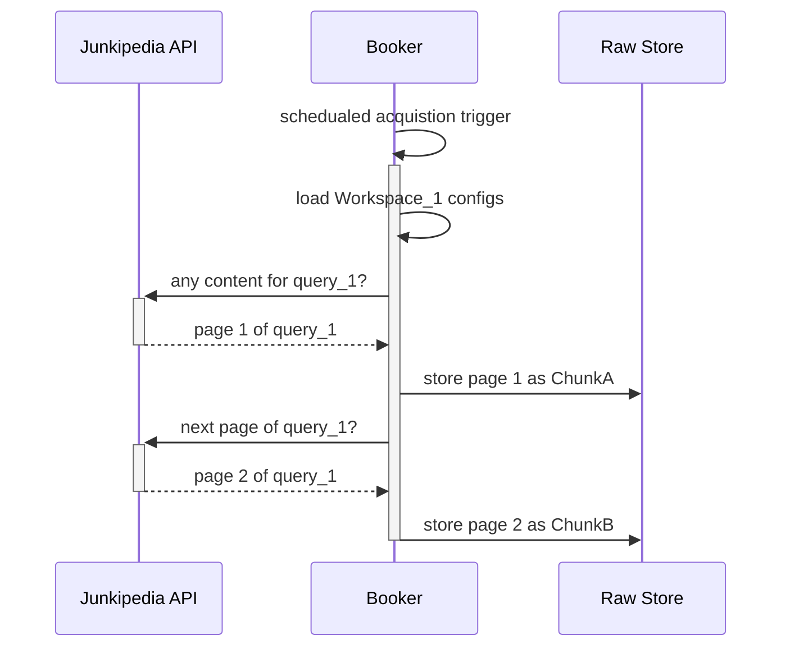

### Booker content aquistion

Sequence diagram of calls for the 'Booker' content acquisition orchestrator to the Junkipedia 3rd party API (for example). 
When triggered from a schedule (or manually) the Booker processes loads up workspace configurations to find out what queries to run, and then pages the API and appends the content chunks into appropriate partitions in the Raw Store. 

