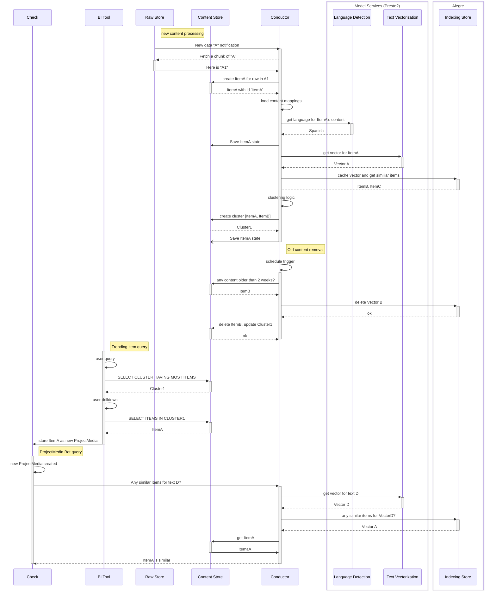

### Conductor content processing and querying

Sequence diagram of calls for the 'Conductor' content processing orchestrator.  This shows:
* new content processing sequence -- content aquistion in the raw store triggers ETL to normalized objects which are stored in the Content store with appropriate vector indexes constructed
*  The old content removal sequence -- content older than two weeks removed from system with appropriate updates to linked objects
* processing an SQL query from a BI Tool -- query is directly to relational database layer for aggregation, and later drill down to individual records that user decides should be recorded in Check for annotation
* handinling a query from a bot in Check -- newly arriving content is vectorized and any matching items are returned to show to user as context for the fact checking process

