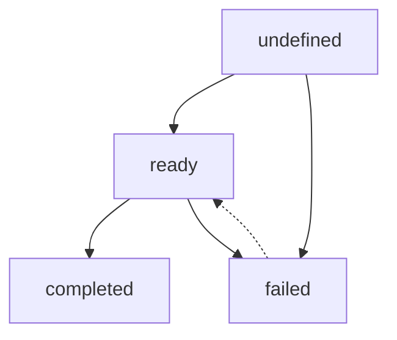
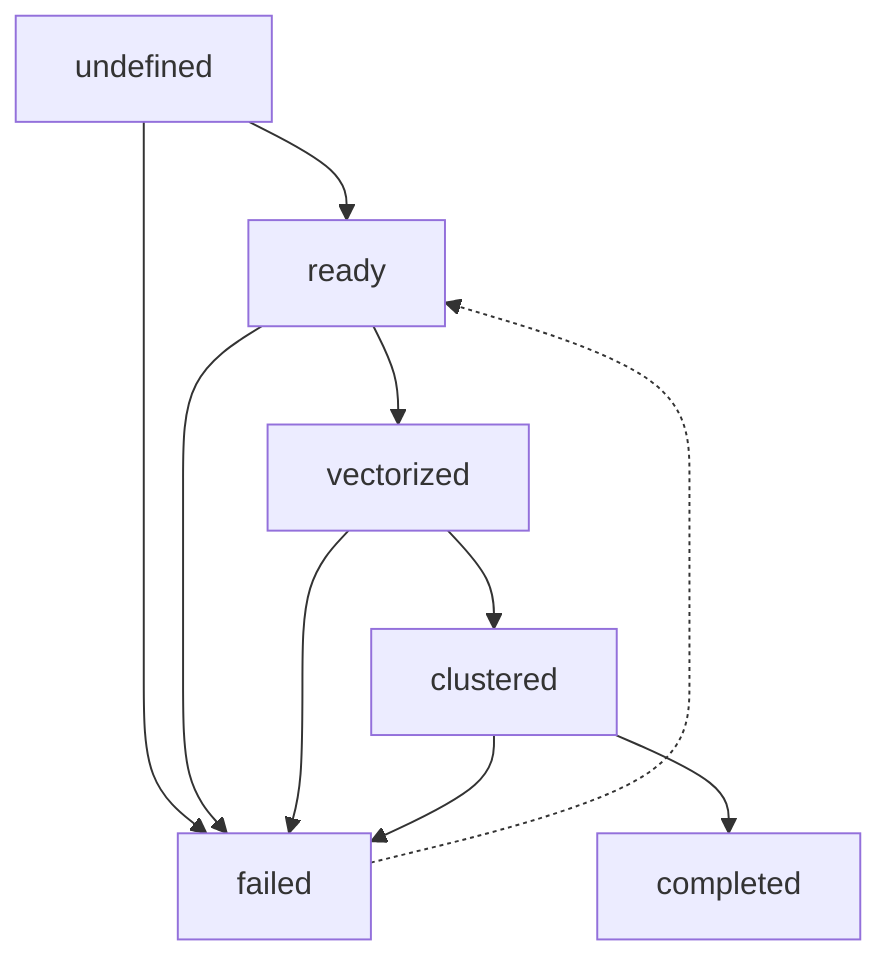
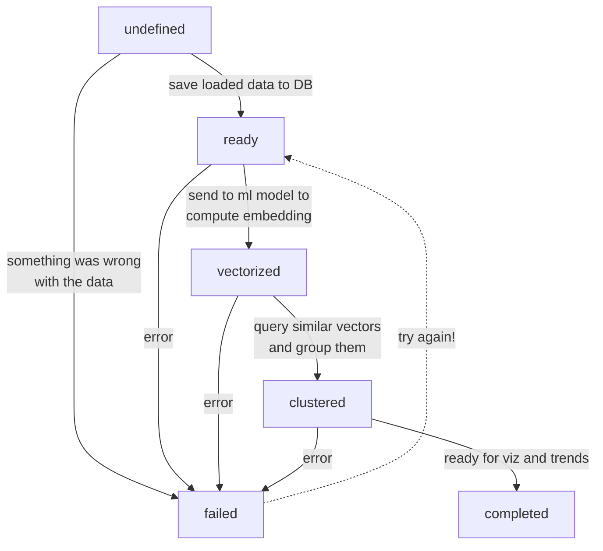
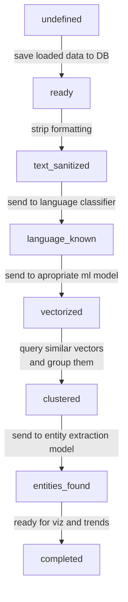

### Defining a Timpani conductor pipeline using state model and workflow

Timpani uses "state models" associated with each workspace to define the sequence of transformations *each* piece of content must pass through.  This is not as fast as performing an operation on a huge batch of data at once, but makes it possible to correct and update problems with individual items.  

It also works well when data must go through processing that involves relatively slow, processor and memory intesnsive steps (like ML models) where reletively few items can be processed at once. 

The goal is to be able to restart and continue processing from any state.


### ContentItemState
Defines the 'base level' state model that all content items must use. 

This doesn't really do anything, the only useful states are 'ready' and 'failed', so no work gets done.
```
    # content item is loaded and ready for first processing tep
    STATE_READY = "ready"

    # something is wrong with this item, don't try it anymore
    STATE_FAILED = "failed"

    # all done, no more transformations needed
    STATE_COMPLETED = "completed"


    valid_states = [
        StateModel.STATE_UNDEFINED,
        STATE_READY,
        STATE_FAILED,
        STATE_COMPLETED,
    ]

    # default transitions for an item with no transformations
    # dictionary maps a state to the states it is allowed to 
    # transition to
    valid_transitions = {
        StateModel.STATE_UNDEFINED: [STATE_READY, STATE_FAILED],
        STATE_READY: [STATE_FAILED, STATE_COMPLETED],
        STATE_FAILED: [STATE_READY],  # for restarts
    }
```
Visually, this gives a state transition diagram like:




#### DefaultWorkflow(DefaultContentItemState)

This *extends* the model, adding additional states and transition so that we can account for the common vectorization and clustering tasks.  Failure is always an option.  But we cant go directly from 'ready' to clustered without passing through 'vectorized'.

```python
"""
Extend the content item state model with aditional states
"""

# define additional states for this model
STATE_VECTORIZED = "vectorized"
STATE_CLUSTERED = "clustered"

valid_states = [STATE_VECTORIZED, STATE_CLUSTERED]

valid_transitions = {
    ContentItemState.STATE_READY: [
        STATE_VECTORIZED,
        ContentItemState.STATE_FAILED,
    ],
    STATE_VECTORIZED: [STATE_CLUSTERED, ContentItemState.STATE_FAILED],
    STATE_CLUSTERED: [
        ContentItemState.STATE_COMPLETED,
        ContentItemState.STATE_FAILED,
    ],
}
```

Here is the diagram for that



The state model controls which transistions are allowed, but the workflow also has to define what work is going to be done for each transition.

The `next_state` function maps the action when transitioning from a state. 

```python
def next_state(self, item: ContentItem, content_store: ContentStoreInterface):
    """
    Apply the next step in the transformation for the content item.
    This defines the processing sequence each individual item will follow
    """

    # figure out what state the item is in
    state = content_store.get_item_state(item.content_item_state_id)

    # (some hidden code here to make sure there isn't transition in progress and we haven't updated too many times)

    # mach the state to the case to see if there is an action defined
    match state.current_state:
        case DefaultContentItemState.STATE_READY:
            # if it is in ready state, send it to be vectorized
            # by the multilingual means tokens model
            content_store.start_transition_to_state(
                item, DefaultContentItemState.STATE_VECTORIZED
            )
            self.means_tokens_model.vectorize_content_item(
                item, target_state=DefaultContentItemState.STATE_VECTORIZED
            )

        case DefaultContentItemState.STATE_VECTORIZED:
            # if vectorized, send it for clustering
            content_store.start_transition_to_state(
                item, DefaultContentItemState.STATE_CLUSTERED
            )
            self.clustering_action.add_item_to_best_cluster(
                item, DefaultContentItemState.STATE_CLUSTERED, store=content_store
            )

        case DefaultContentItemState.STATE_CLUSTERED:
            # our work here is done
            content_store.transition_item_state(
                item, DefaultContentItemState.STATE_COMPLETED
            )
        case _:  # nothing matched
            logging.error(
                f"Item {item.content_item_id} state {state.current_state} does not match states for workflow {self.get_name}"
            )
```

The conductor pulls a bunch of items from the content store, and calls a service. When the service calls back, the state is updated, indicating that it is ready for the next action. If no response is recieved (if data was lost or service down) the item remains in the same state so it will be picked up again.

If there is a problem calling the action, the item will be put into the error state.



#### Extending to more complex processing

We can model more complex workflows this way. And it allows us to define different workflows for different teams or projects, without each of the services need lots of logic to decide what transformations should be applied. 

It is also helpful to be able to restart the process after fixing problems with a particular service (dealing with edgecases in the data, for example).

(not showing failure transitions, since always there)


