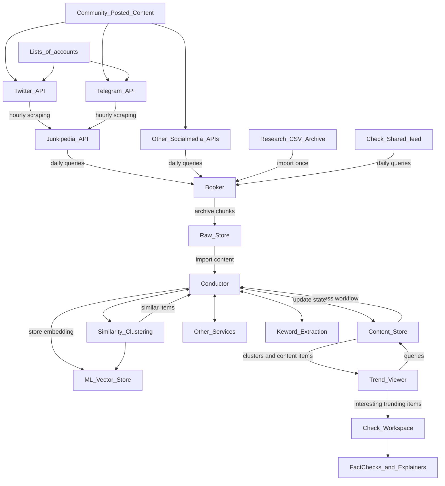

### Simplified Timpani Data flow

Using a 3rd party service like Junkipedia, users can provide a list off accounts on various social media services to monitor with regular scraping. This content can be collected via API.

When triggered from a schedule (or manually) the Booker queries a data source for new items and archives them in the Raw Store. The Conductor imports content items, and sends them out to other services to be processed. The content, annotations, and clusters are stored in the Content Store.  The Trend Viewer tool queries the Content Store to show trends and explore the items grouped in a cluster.

