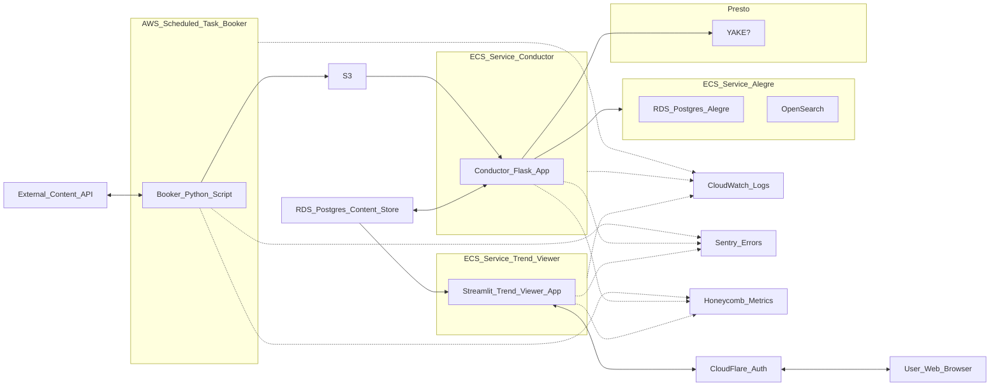

### Timpani infrastructure diagram

QA/Live AWS infrastructure components for timpani

```mermaid
graph LR

    subgraph AWS_Scheduled_Task_Booker
        Booker_Python_Script 
    end
    AWS_Scheduled_Task_Booker -.-> CloudWatch_Logs

    Booker_Python_Script --> S3
    External_Content_API <-->  Booker_Python_Script 
    Booker_Python_Script  -.-> Sentry_Errors
    Booker_Python_Script  -.-> Honeycomb_Metrics
    
    subgraph ECS_Service_Conductor
        Conductor_Flask_App
    end
    ECS_Service_Conductor -.-> CloudWatch_Logs

    S3 --> Conductor_Flask_App

    subgraph ECS_Service_Alegre
        RDS_Postgres_Alegre
        OpenSearch
    end
    Conductor_Flask_App --> ECS_Service_Alegre 

    subgraph Presto
        YAKE?
    end
    Conductor_Flask_App --> YAKE? 
    
    
    Conductor_Flask_App -.-> Sentry_Errors
    Conductor_Flask_App -.-> Honeycomb_Metrics

    RDS_Postgres_Content_Store <--> Conductor_Flask_App 
    
    subgraph ECS_Service_Trend_Viewer
        Streamlit_Trend_Viewer_App
    end
    ECS_Service_Trend_Viewer -.-> CloudWatch_Logs
    
    Streamlit_Trend_Viewer_App -.-> Sentry_Errors
    Streamlit_Trend_Viewer_App -.-> Honeycomb_Metrics
    RDS_Postgres_Content_Store  --> Streamlit_Trend_Viewer_App 

    Streamlit_Trend_Viewer_App <--> CloudFlare_Auth <--> User_Web_Browser
    
    
    
```
